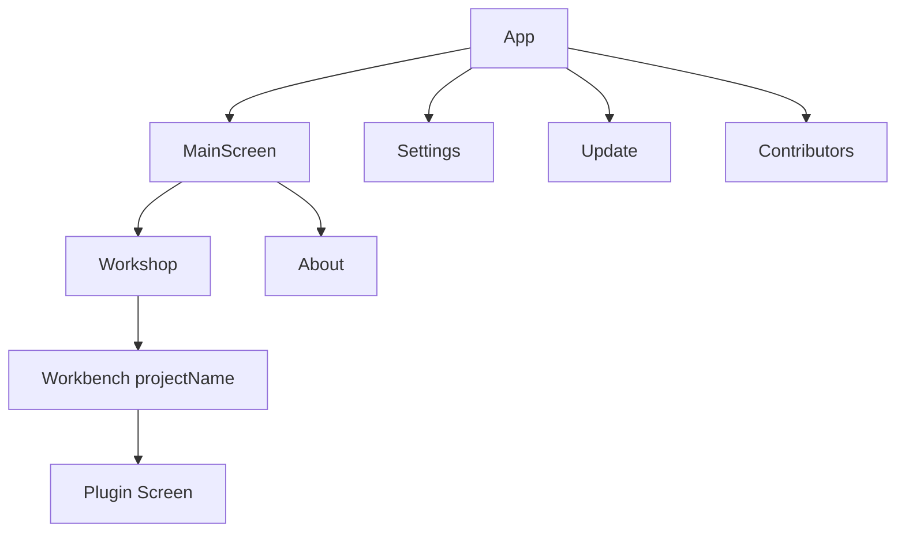

# 架构说明

## 总体结构

应用入口 `App` 负责：

- 读取应用设置
- 初始化主题控制器
- 建立导航宿主
- 承载全局浮窗与全局任务 UI

## 路由层

当前路由对象覆盖的页面包括：

- `Main`
- `Settings`
- `Workshop`
- `Workbench(projectName)`
- `Plugin(projectName)`
- `Update`
- `Contributors`
- `OpenSourceLicenses`

这里可以看出一个很重要的设计点：**项目上下文通过路由参数传递**，例如 `projectName`。

## 模块职责建议

### core

放置与具体页面无关但被多个模块共用的能力，例如：

- 设置
- Shell 执行
- 任务调度
- 文件与镜像处理相关工具

### feature

按业务页面拆分，适合维护：

- 屏幕 UI
- 页面状态
- 交互逻辑
- 对 `core` 能力的组合调用

### di

统一组织依赖注册，保证页面模型和服务对象有清晰入口。

### plugin

这一层既包括插件 API，也包括宿主侧管理逻辑，是项目未来扩展能力的关键。

## 当前数据流理解

从现有结构推断，页面数据流大致是：

1. `App` 建立导航与主题环境
2. Feature Screen 负责展示页面
3. ScreenModel 负责状态与业务交互
4. ScreenModel 调用 `core` 或 `plugin` 层能力
5. 全局任务与浮窗 UI 用于承载后台执行反馈

## 为什么这种结构适合继续演进

- 共享代码集中在 `commonMain`，平台扩展成本较低
- 页面按 feature 拆分，文档与源码容易一一对应
- 插件系统可以逐步独立成稳定边界
- 发布策略与版本逻辑已具备自动化基础
