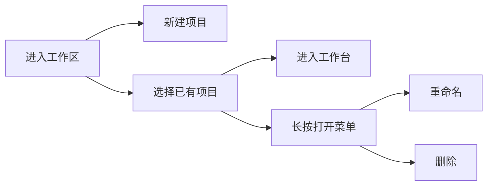

# 工作区与项目

## 功能定位

`Workshop` 是项目入口页，负责管理 ROM 项目集合。

从现有说明与 UI 逻辑可以确认它包含：

- 创建项目
- 打开项目
- 重命名项目
- 删除项目

## 典型用户流程

## 为什么这个页面很关键

在 ImageStudio 里，很多后续能力都依赖“当前项目上下文”，因此工作区不是简单列表页，而是整个应用的入口分发层。

## 文档建议写法

如果你后续要继续细化用户文档，可以把这一页继续拆成：

- 项目目录结构说明
- 项目命名建议
- 删除项目会影响哪些文件
- 重命名是否同步底层目录
- 项目损坏后的恢复办法

## 对开发者的提示

工作区页天然适合承载以下扩展：

- 最近项目
- 项目标签或分组
- 项目缩略信息
- 导入现有项目
- 项目模板
